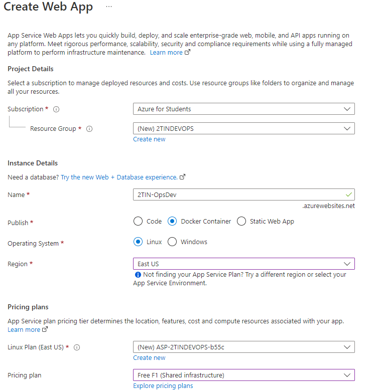
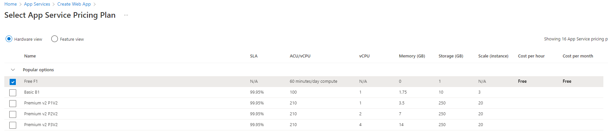

[](https://classroom.github.com/a/xj-1jc0m)
# Integratieopdracht DevOps
`voorzie badge hier (zie opgave)`

[](https://github.com/khalildobapxl/test/actions/workflows/creators-OpsDev-CI.yml)


## Inleiding
Het bedrijf OpsDev heeft met argusogen de lessen Devops op 2TIN meegevolgd en is zelf aan de slag gegaan aan een eigen versie van de calculator app die we gebruikt hebben tijdens de lessen. Je zou kunnen stellen dat er enkele gelijkenissen zijn tussen de app gebruikt tijdens de les en die van het bedrijf. Naast het ‘op een correcte manier kopiëren van applicaties’ is het bedrijf OpsDev ook vies van Jenkins en (lokaal gehoste) virtuele machines.

Jij start als junior-collega in het bedrijf OpsDev en bent verantwoordelijke voor het opzetten van een systeem waarbij je CI & CD toepast. Zoals aangegeven mag er geen jenkins of virtuele machine gebruikt worden. Op aangeven van Kevin, Head of Operations (Je baas), ga je je verdiepen in Github actions en docker. De code van hun calculator applicatie is terug te vinden in deze repository.


_(a) Inventariseer kort in oplossing.md waarvoor github actions en docker gebruikt worden. Wie zit er achter deze toepassingen? Wat is het doel?_


_Maak een account aan op [dockerhub](https://hub.docker.com/)._

# Let's get started!
OpsDev hecht veel waarde aan kwaliteit & feedback. Een CI/CD pipeline is dan ook een must-have voor het bedrijf. Helaas heeft in-house niemand buiten jijzelf de kennis om CI/CD pipelines te bouwen.

Voor de continious integration fase van het bouwen en testen van de applicatie zal je gebruik maken van Github actions.  Je zal merken dat hier verschillen in zitten ten opzichte van jenkins. 

Github actions heeft meteen een zeer goede integratie met het Github ecosysteem. Dit is iets waar je perfect gebruik van kan maken. Je zal de guidelines van de documentatie strict  moeten volgen om een werkend product te krijgen.

 _Begin alvast met het volgende van de quickstart guide op [deze link](https://docs.github.com/en/actions/quickstart) en pas deze toe op deze repository._


_(b) Na het verkennen van Github Actions zal je merken dat er gebruikt gemaakt wordt van yaml files. Wat voor soort files zijn dit? hoe zijn die opgebouwd? Hoe zit een yaml syntax/structuur eruit? Documenteer in oplossing.md_

# CI workflow
Het eerste doel van onze CI "workflow", zo noemen we een pipeline in Github Actions, is dat de github repository code binnengetrokken wordt. Je zal merken dat dit op zich vrij eenvoudig gaat. Voorzie een nieuwe workflow met als naam `<groepsnaam>-OpsDev-CI` die draait op een ubuntu systeem met daarin een stap die de code van de repository binnentrekt. De nodige info hiervoor kan je terugvinden in de quickstart guide die hierboven gelinkt was.

De volgende stap is het voorzien van triggers voor de workflow. Wanneer wordt de workflow uitgevoerd? Bekijk [deze documentatie](https://docs.github.com/en/actions/learn-github-actions/events-that-trigger-workflows). En zorg ervoor dat de pipeline handmatig gestart kan worden & dat de pipeline ook automatisch runt bij een nieuwe push naar de main branch.


_Start de pipeline handmatig om te testen of je workflow werkt. Bekijk de output in de actions tab van je repository_

Hierna willen we graag de unittesten van de applicatie runnen. hiervoor hebben we eerst de dependencies(=node_modules) van de applicatie nodig. Deze kan je installeren via het commando `npm install` dat je in de pipeline dient uit te voeren. Hiervoor heb je uiteraard nodeJS nodig. Lees [deze documentatie](https://docs.github.com/en/actions/automating-builds-and-tests/building-and-testing-nodejs-or-python) door en voorzie een stap die nodeJS integreert in je workflow. Daarna voorzie je ook een stap die de dependencies installeert. Tenslotte voorzie je een stap die de unittesten uitvoert.

Het rapport willen we graag archiveren als artifact van de build poging. Voorzie een stap die dit doet. Informatie hierover kan je [hier](https://docs.github.com/en/actions/advanced-guides/storing-workflow-data-as-artifacts) terugvinden.

Feedback is belangrijk. Het is mogelijk om een badge toe te voegen aan de `README.MD` die de status van de laatste build poging weergeeft. Voorzie dit a.d.h.v. [deze documentatie](https://docs.github.com/en/actions/monitoring-and-troubleshooting-workflows/adding-a-workflow-status-badge).

# Integratie pull requests
Zorg ervoor dat de CI workflow ook uitgevoerd wordt bij het maken van een pull request. 
Test dit uit door nieuwe feature uit te werken aan de hand van de Github flow. Je werkt de feature uit om machtsberekeningen te maken. Maak na het afwerken van de feature een Pull request aan voor de merge. Controleer of de workflow ook effectief uitgevoerd wordt. 

# Continious delivery
Voorzie een nieuwe workflow in je repository met als naam '`<groepsnaam>-OpsDev-CD`. Deze workflow wordt enkel manueel gestart. Het doel van deze workflow is dat er een container gebouwd wordt en dat deze image naar dockerhub gepusht wordt (Je baas is enorme fan van Docker, hij heeft daar namelijk verschillende tshirts van).


_(c) Wat is Dockerhub juist? Waarvoor kunnen we dat gebruiken?_


_Maak een nieuwe repository aan op dockerhub (één teamlid is voldoende) met de naam opsdev-calculator. Deze maak je publiek en je plaatst de link in `oplossing.md` bij onder punt (c)_
```
https://hub.docker.com/r/JOUWURL
```

https://github.com/marketplace/actions/docker-login
Voor de opzet van je CD pipeline helpen we je graag verder:

*   Je zal je login credentials (username & personal acccess token) voor dockerhub moeten toevoegen als secrets aan de repository.
    _tip: gebruik hiervoor in [Github secrets](https://docs.github.com/en/actions/security-guides/encrypted-secrets)_
*   Vervolgens maak je gebruik van de volgende 2 actions plugins:
    - https://github.com/marketplace/actions/docker-login
    - https://github.com/marketplace/actions/build-and-push-docker-images
    


_Voorzie een `Dockerfile` in de root van deze repository die de nodeJS opstart (denk ook aan de `npm install` in de container)_


_Na het aanmaken van de Dockerfile kan je starten met de deployment workflow. Bekijk hiervoor de documentatie van de linken hierboven._

**!Let op: de credentials mogen niet zichtbaar zijn in yml file!**

Tenslotte willen we bij elke push naar dockerhub een bericht krijgen in onze discord server. Bouw zelf een nieuwe discord server (of gebruik een bestaande) en voorzie discord alerts. Documentatie hiervoor kan je [hier](https://github.com/marketplace/actions/actions-for-discord) terugvinden. Ook hier willen we niet dat de webhook url zichtbaar is in de yml file.


_(d) Waarom maken we voor het gebruik van de credentials & webhook URL gebruik van secrets? Wat is daar het voordeel van? Zijn er nog andere manieren waarop je dit kon doen?_

# Deploy naar Azure
Via [deze link](https://azure.microsoft.com/nl-nl/free/students/) kan je op Microsoft Azure een gratis student account aanmaken waarop je 100$ krijgt om te spenderen op het Azure cloud platform. Belangrijk is dat je je aanmeldt met je school e-mail adres.


_(e) Wat is Azure? Wat zijn de grootste concurrenten? Wat is het grote verschil tussen iaas, paas en saas en hoe past dit in het cloud plaatje?_

De build & push naar dockerhub is natuurlijk geen echte deployment. Als extra challenge gaan we nu vanuit Github actions een push voorzien naar Azure app services. Dit is een dienst waar je vrij eenvoudig containers kan opstarten/hosten die publiek op het internet beschikbaar zijn.

Ga naar via het menu naar _app services_. Vervolgens maak je een nieuwe app aan met volgende instellingen:



Let er op dat je bij "pricing plan" kiest voor de optie "FREE F1". Hiervoor moet je mogelijks op de link _explore pricing plans_ klikken:



Vervolgens kan je in de overview pagina op de link _Get Publish profile_ klikken. De inhoud van deze file voeg je toe als secret aan je repository met als naam `AZURE_WEBAPP_PUBLISH_PROFILE` (dit is nodig om toegang te krijgen tot Azure voor de deployment). 

De effectieve deployment stappen vanuit je github actions pipeline kan je opbouwen aan de hand van de volgende documentatie:
[https://docs.github.com/en/actions/deployment/deploying-to-your-cloud-provider/deploying-to-azure/deploying-docker-to-azure-app-service#creating-the-workflow](https://docs.github.com/en/actions/deployment/deploying-to-your-cloud-provider/deploying-to-azure/deploying-docker-to-azure-app-service#creating-the-workflow)
 
 _tip: een absolute url naar je publieke docker image is bijvoorbeeld: `docker.io/driessw/opsdev-calc`_

 
_(f) Voorzie de publieke url van je applicatie en toon een screenshot van je aangemaakte app service in het azure dashboard_

# Deliverable
- Een CI workflow
- Een status badge in de `README.md` file
- Een uitgewerkte machtsberekeningsfeature a.d.h.v. de Github flow met daarbij een PR met geintegreerde CI run. (Credentials / tokens in de pipelin e= -30% op het eindcijfer)
- Een CD workflow (Credentials / tokens in de pipelin e= -30% op het eindcijfer)
- Een opgevulde `oplossing.md` file voor punten a t.e.m. f.


